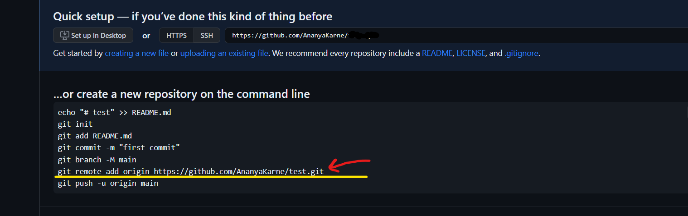

## ☆☆☆☆ Create a repository ☆☆☆☆
- login to github
- Click the "+" which is fourth from right to your profile pic at the top right of the screen.
- click on new repository
- name the repository
- description optional
- choose "Public" or "Private"
- Create
## ☆☆☆☆ Initialize repo in VS Code ☆☆☆☆
- create a New Folder.
- create new file in it.(with the fileextension you want)
- save it!!(Ctrl+S)
- #### Now Open  Terminal (ctrl+shift+` )( or from the menu on the top click "Terminal -> New Terminal)
> #### ⚠️Perform the following in the right directory⚠️(e.g. E: \testfile>)
- type the following code:
  
  >  git init
  
  >  git add .
  
  >  git commit -m " your message "
  
  >  now copy "git remote add origin https://github.com/AnanyaKarne/gitlearn.git" from here:
  
  > 
  
  > and paste it in the terminal
  
  > git push origin master
- So now your github repo and your present vs code folder is connected.
- ### For commmiting the codes further:
> git add .
  
  > git commit -m "your message"
  
  > git push origin master

- ### If you make changes in Githib and want them in your vs code in the same folder
### type: 
  > git pull origin master
